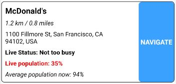
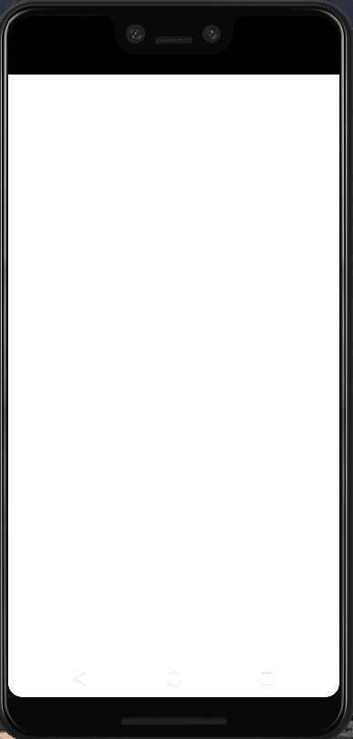
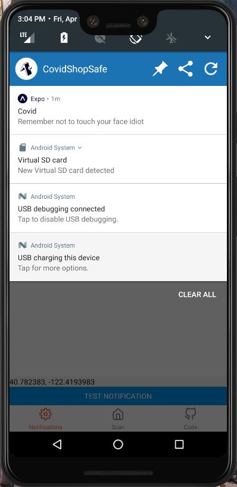
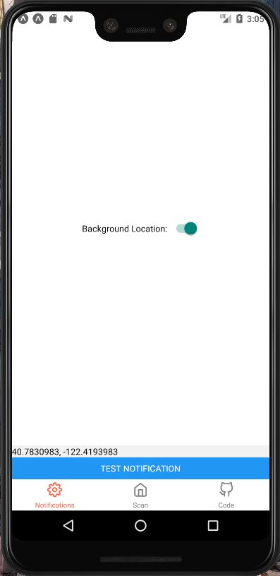

# CovidSafeShop

This project was assembled during the 2020 HackQuarantine by https://github.com/m-wrzr/populartimes, [River Dennis](https://github.com/scifipanda), and [Nick Guzzardo](https://github.com/NickGuz).

## Summary

CovidSafeShop is an android application which aims to provide users with a safe and reliable way to shop. Whether you're on the look for supplies or trying to pick up dinner it is best to avoid large crowds during a time like this. CovidSafeShop provides live population data of buinsesses near by, you can search for place for example a bike shop all the way from mcdonalds your options are endless.
This feature is incredible important for keeping the people safe during their trips. With this data in hand you can always make sure you're picking the buisness with the least amount of population minimzing your risk of spreading or catching Covid-19.
The app gets live data from our flask api endpoint. It uses a 3rd party python librain to help grab the live population data which can be found [HERE](https://github.com/m-wrzr/populartimes).

## Application Pages.

**Scan page**

This is the main page which will provide users with the live population data needed to stay safe when shopping. As you can see below if you want more information about the page you can slick the navigate button which will bring you to its exact location on which ever map you use.

Example Item

Page Walk Through

**Notification page**

This page lets the user turn on or off automatic notificatons based on the users location. If this setting is on then the app will scan your location periodily. If you ever step in a store the application will realize and send you a reminder to not touch your face and wash your hand when you're done. This new life style for us requires us to be very cautious while we are out. Some people still have trouble adjusting which why is this notification is geared towards remind you to be safe.

**Code**

This page will bring you to our github project.

## Languages

CovidSafeShop was built with React Native and our backend server was built with flask

## APIs

## React-Native
